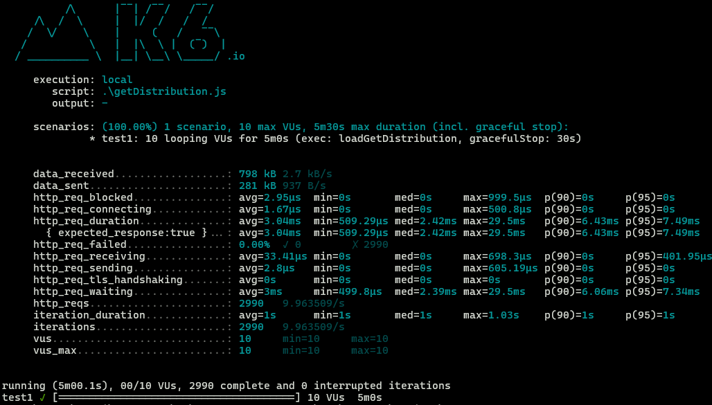
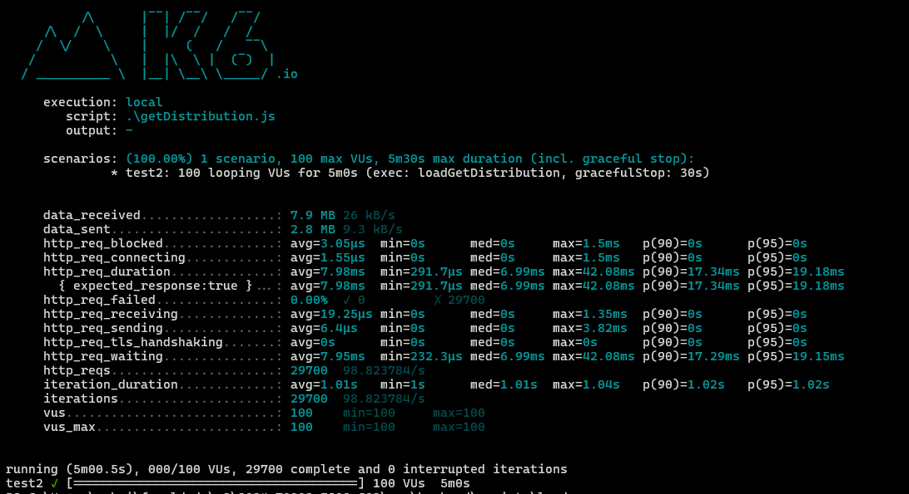
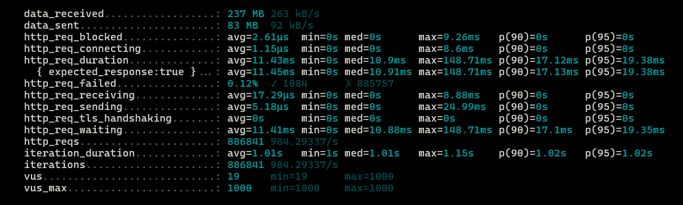
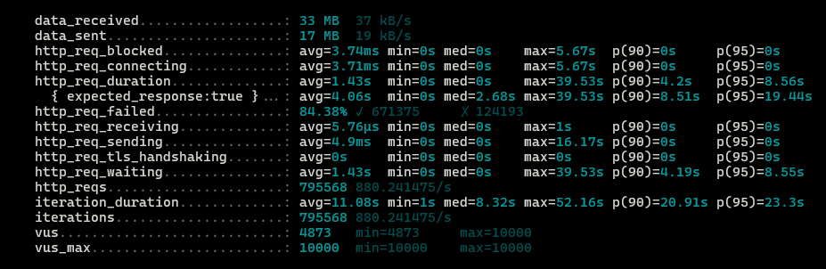
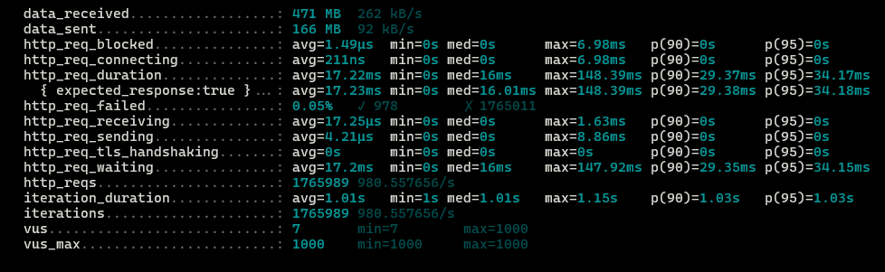
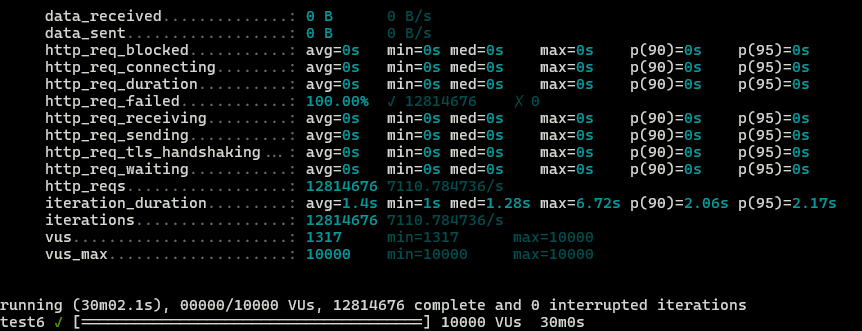

# Testes com K6

Nessa atividade, realizei um teste de carga no meu projeto com o K6. O K6 é uma ferramenta de código aberto que permite a execução de testes de carga e de stress em aplicações web. Com ele, é possível simular o comportamento de milhares de usuários acessando o seu site ao mesmo tempo. Essa ferramenta é muito útil para identificar gargalos e problemas de performance em aplicações web.<br>

O teste foi feito no endpoint getDistribution.

## Código
```javascript
import http from 'k6/http';
import { sleep } from 'k6';

export const options = {

  scenarios: {
    test1:{
      executor: 'constant-vus',
      vus: 10,
      duration: '5m',
      exec: 'loadGetDistribution'
    },
    test2:{
      executor: 'constant-vus',
      vus: 100,
      duration: '5m',
      exec: 'loadGetDistribution'
    },
    test3:{
      executor: 'constant-vus',
      vus: 1000,
      duration: '15m',
      exec: 'loadGetDistribution'
    },
    test4:{
      executor: 'constant-vus',
      vus: 10000,
      duration: '15m',
      exec: 'loadGetDistribution'
    },
    test5:{
      executor: 'constant-vus',
      vus: 1000,
      duration: '30m',
      exec: 'loadGetDistribution'
    },
    test6:{
      executor: 'constant-vus',
      vus: 10000,
      duration: '30m',
      exec: 'loadGetDistribution'
    },

  }

};


export function loadGetDistribution() {
  http.get('http://127.0.0.1:8080/distribuitions');
  sleep(1);
}
```

## Testes realizados
### Teste 1
- 10 usuários
- 5 minutos de duração
<br>
**Resultado:**


### Teste 2
- 100 usuários
- 5 minutos de duração<br>
**Resultado:**


### Teste 3
- 1000 usuários
- 15 minutos de duração<br>
**Resultado:**



### Teste 4
- 10000 usuários
- 15 minutos de duração<br>
**Resultado:**


### Teste 5
- 1000 usuários
- 30 minutos de duração<br>
**Resultado:**


### Teste 6
- 10000 usuários
- 30 minutos de duração<br>
**Resultado:**


Não foi possível realizar o teste com 10000 usuários pela grande quantidade de erros que estavam ocorrendo. O servidor não estava conseguindo responder a todas as requisições.


## Conclusão

Com os testes realizados, foi possível identificar que o servidor não consegue responder a todas as requisições quando o número de usuários é muito grande. Isso indica que o servidor não está preparado para receber um grande número de requisições simultâneas. Para resolver esse problema, é necessário otimizar o código do servidor e/ou aumentar a capacidade de processamento do servidor. Além disso, é importante monitorar a aplicação constantemente para identificar possíveis gargalos e problemas de performance. O K6 é uma ferramenta muito útil para realizar testes de carga e identificar problemas de performance em aplicações web.


